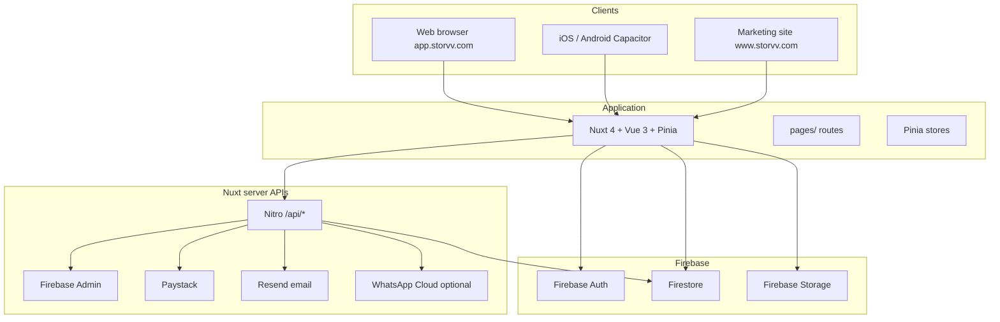
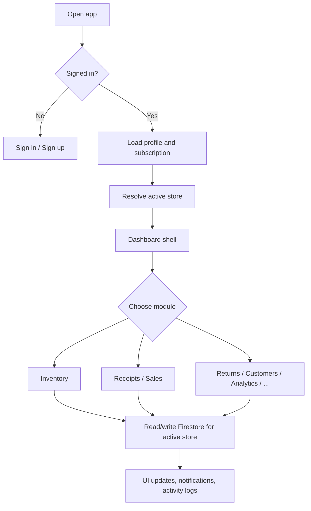

# How Storvv Works

Storvv is a retail operations platform for businesses that need to track **inventory**, **sales**, **returns**, and **customers** across one or more store locations. This document explains what the product does, how it is built, and how the main pieces fit together.

> **Full reference:** For the complete product and technical guide (every module, data model, permissions, APIs, and workflows), see **[STORVV_COMPLETE_GUIDE.md](./STORVV_COMPLETE_GUIDE.md)**.

For step-by-step user journeys and module behavior, see [STORVV_APP_FLOW.md](./STORVV_APP_FLOW.md). For subscription tiers and limits, see [SUBSCRIPTION_FEATURES.md](./SUBSCRIPTION_FEATURES.md).

---

## What Storvv Is

Storvv helps retail and similar businesses answer three questions every day:

1. **What do we have in stock?** - Organized inventory with custom fields per product category.
2. **What did we sell?** - Receipts (sales records) tied to line items, payments, and customers.
3. **Who did what?** - Roles, activity logs, and notifications for operational visibility.

The product is aimed at store owners, managers, and front-line staff. A single **account owner** (super admin) can run one store on the Micro plan or scale to multiple branches on Medium and Enterprise plans.

**Brand and codebase naming**

| Name              | Meaning                                       |
| ----------------- | --------------------------------------------- |
| **Storvv**        | Product and brand (`storvv.com`)              |
| **storv-ui**      | This repository and npm package               |
| **com.storv.app** | Native iOS/Android app identifier (Capacitor) |

---

## Who Uses It and How Access Works

### Roles

| Role            | Typical user                | What they can do                                                                                 |
| --------------- | --------------------------- | ------------------------------------------------------------------------------------------------ |
| **Super admin** | Account owner who signed up | Create stores, folders, staff; switch branches; full settings; destructive actions where allowed |
| **Manager**     | Senior staff                | Broader edit on sales, refunds, and operations (plan and rules permitting)                       |
| **Staff**       | Day-to-day sellers          | Sell via receipts, view inventory; limited structural changes                                    |

Authentication uses **Firebase Auth** (email/password and related flows). After sign-in, the app loads a **user profile** from Firestore with `role` and `subscription` so the UI can show the right screens and limits.

### Subscription plans

Plans unlock features and caps (stores, departments, staff counts). Summary:

| Plan           | Stores    | Highlights                                                                                    |
| -------------- | --------- | --------------------------------------------------------------------------------------------- |
| **Micro**      | 1         | Core inventory, receipts, returns, customers; WhatsApp (10/mo)                                |
| **Medium**     | Up to 2   | + Analytics, activity logs, customer balance, teams, unlimited WhatsApp, duplicate categories |
| **Enterprise** | Unlimited | + Multi-store sync, copy templates across branches, stock loans, priority support             |

Billing uses **Paystack** (NGN). Plan details and implementation hooks are documented in [SUBSCRIPTION_FEATURES.md](./SUBSCRIPTION_FEATURES.md).

---

## Core Concepts

Understanding these four ideas explains most of the app.

### 1. Active store (branch context)

Almost all dashboard data is scoped to the **currently selected store**. Super admins pick the branch in the header **store switcher**. Staff are usually bound to one assigned store.

When the active store changes, lists and forms refetch data for that branch so inventory, receipts, and customers never mix between locations.

### 2. Inventory folders and items

Inventory is two levels:

- **Folders** - Categories with a **template** (custom fields: brand, serial, price, color, etc.). Example: “Phones” or “Vehicle parts.”
- **Items** - Rows inside a folder; each row is a product or serial line.

Stock levels are driven primarily by **sales and returns**, not arbitrary manual edits, so quantities stay aligned with receipts.

### 3. Receipts (sales)

A **receipt** is a sale record: line items, totals, optional customer, payment method, and status (e.g. completed or pending). Creating a receipt can reduce stock; processing a **return** links back to the original receipt for auditability.

Receipts can be shared via a **public link** (`/r/[token]`), emailed, or sent on WhatsApp where the plan allows.

### 4. Data ownership (super admin tree)

Business data lives under the **account owner’s** Firestore path, not under each staff member’s UID. When staff sign in, queries resolve to the owner’s `users/{ownerId}/stores/{storeId}/...` tree. That keeps one tenant’s data isolated and lets staff work on the correct branch without seeing other businesses.

---

## System Architecture

Storvv is a **Nuxt 4** single-page application (Vue 3) with **no SSR** - it is generated as static files for web and wrapped in **Capacitor** for iOS and Android. Business data is stored in **Firebase** (Auth, Firestore, Storage). Privileged or cross-tenant operations run on **Nuxt server routes** (Nitro) with **Firebase Admin**.



### Three layers in the codebase

| Layer     | Responsibility                            | Where it lives                                                           |
| --------- | ----------------------------------------- | ------------------------------------------------------------------------ |
| **UI**    | Pages, layouts, components                | `pages/`, `layouts/dashboard.vue`, `components/`                         |
| **State** | Caching, loading, client-side permissions | `stores/` (Pinia), `composables/`                                        |
| **Data**  | Persistence and security                  | Firestore paths in `composables/useFirestorePaths.ts`, `firestore.rules` |

### Typical request flow

1. User opens the app → Firebase Auth session is restored.
2. If unauthenticated → sign-in or marketing pages.
3. If authenticated → user profile and store list load; **active store** is set.
4. User opens a dashboard route → page reads/writes Firestore via Pinia actions, scoped by owner UID + `storeId`.
5. For PDF email, Paystack checkout, receipt share links, or serial validation → client calls `/api/*` with a Firebase ID token; server uses Admin SDK and third-party APIs.

On **native apps**, the UI is the same static bundle; API calls may target a hosted origin via `NUXT_PUBLIC_API_BASE` so server routes still work without bundling Nitro into the app shell.

---

## Data Model (Firestore)

Data is hierarchical. The helper `composables/useFirestorePaths.ts` defines canonical paths:

```
users/{ownerUserId}/
  stores/{storeId}/
    departments/{departmentId}/staff/{staffId}
    inventoryFolders/{folderId}
    inventoryItems/{itemId}
    receipts/{receiptId}
    customers/{customerId}
    customerAccounts/{accountId}
    notifications/{notificationId}
    activityLogs/{logId}
    sellerLoanOuts/{loanId}
    members/{memberAuthUid}
  pendingCheckouts/{reference}      # Paystack
  whatsappUsage/{monthKey}
```

**Security** is enforced in `firestore.rules` and `storage.rules`. Client-side feature gates (`useSubscriptionFeatures`, `usePermissions`) hide UI the user should not use; rules are the source of truth for writes.

---

## Main Product Areas

| Area                   | Purpose                                         | Typical route                                       |
| ---------------------- | ----------------------------------------------- | --------------------------------------------------- |
| **Dashboard**          | Overview and quick stats                        | `/dashboard`                                        |
| **Inventory**          | Folders and items                               | `/dashboard/inventory`, `/dashboard/inventory/[id]` |
| **Receipts / Sales**   | Create and manage sales; customers tab          | `/dashboard/receipts`                               |
| **Returns**            | Refunds tied to receipts                        | `/dashboard/returns`                                |
| **Customers**          | Buyer history                                   | `/dashboard/customers`                              |
| **Analytics**          | Charts and exports (Medium+)                    | `/dashboard/analytics`                              |
| **Activity logs**      | Audit trail (Medium+, role-gated)               | `/dashboard/activity`                               |
| **Multi-store sync**   | Transfers and consolidated reports (Enterprise) | `/dashboard/multi-store-sync`                       |
| **Seller loans**       | Serial stock lent out (Enterprise)              | `/dashboard/seller-loans`                           |
| **Settings / Profile** | Branding, billing, account                      | `/dashboard/settings`, `/dashboard/profile`         |
| **Onboarding**         | Currency, country, first store setup            | `/dashboard/onboarding`                             |
| **Public receipt**     | Share link, no login                            | `/r/[token]`                                        |

The **dashboard layout** (`layouts/dashboard.vue`) provides the sidebar (or bottom nav on native), store selector, global search, notifications, and theme toggle. Navigation items are filtered by **plan** and **role**.

---

## End-to-End Session Flow



**First-time owners** often complete **onboarding** (currency, geography, store details) before numbers and formats look correct everywhere.

**Enterprise multi-branch** workflows commonly include: create Branch B → switch store context → **Copy from branch** (folder templates only, no stock) → optionally **Multi-store sync** when physical stock moves between locations.

---

## Integrations

| Service                | Role in Storvv                                                  |
| ---------------------- | --------------------------------------------------------------- |
| **Firebase Auth**      | Sign-in, session, ID tokens for API calls                       |
| **Firestore**          | All operational data                                            |
| **Firebase Storage**   | Images and uploads (see [STORAGE_SETUP.md](./STORAGE_SETUP.md)) |
| **Paystack**           | Subscription checkout and verification                          |
| **Resend**             | Transactional email (e.g. receipt delivery)                     |
| **WhatsApp Cloud API** | Optional receipt messaging; usage caps by plan                  |
| **Cloudinary**         | Optional account logo hosting                                   |

Server endpoints live under `server/api/` (receipts, Paystack, stores, inventory validation, WhatsApp usage, storage helpers).

---

## Where Storvv Runs

### Web

- **Marketing** - Landing, pricing, legal (`pages/index.vue`, `/privacy`, `/terms`). Often served on `www.storvv.com` or configured marketing hosts.
- **App** - Authenticated product on `app.storvv.com` (subdomain routing in `middleware/00-subdomain.global.ts`).

### Mobile (Capacitor)

The same Nuxt build is copied to `dist` and synced into native projects (`ios/`, `android/`). Config: `capacitor.config.ts` (`appId: com.storv.app`, `appName: Storvv`). Build: `npm run cap:build`.

Native shells use a **bottom navigation** pattern instead of the desktop sidebar.

### Deployment

Hosted on **Vercel** with static frontend generation and serverless `/api/*` functions. See [DEPLOYMENT.md](../DEPLOYMENT.md) for environment variables and staff sign-in notes.

Key environment patterns are documented in `.env.example` and `nuxt.config.ts` `runtimeConfig` (Firebase public keys, Paystack, Resend, API base, app/marketing hosts).

---

## Authorization Model (Summary)

Access is a function of **role**, **subscription plan**, and **store context**:

- **Role** - What actions you can perform (create folders, approve refunds, open multi-store tools).
- **Plan** - Which sidebar modules exist and numeric limits (stores, departments, staff).
- **Store** - Which branch’s data you read and write; without a store, many pages cannot load meaningful data.

Example: **Copy from branch** requires super admin + Enterprise + at least two stores. **Analytics** requires Medium or Enterprise.

---

## Repository Map (Quick Reference)

| Topic               | Path                                                                                               |
| ------------------- | -------------------------------------------------------------------------------------------------- |
| Routes              | `pages/`                                                                                           |
| Dashboard shell     | `layouts/dashboard.vue`                                                                            |
| Pinia state         | `stores/`                                                                                          |
| Firestore paths     | `composables/useFirestorePaths.ts`                                                                 |
| Permissions / plans | `composables/usePermissions.ts`, `composables/useSubscriptionFeatures.ts`, `types/subscription.ts` |
| Auth                | `stores/auth.ts`, `middleware/auth.global.ts`                                                      |
| Security rules      | `firestore.rules`                                                                                  |
| Server APIs         | `server/api/`                                                                                      |
| Capacitor           | `capacitor.config.ts`, `plugins/00.capacitor.client.ts`                                            |
| Tests               | `tests/README.md`                                                                                  |

---

## Related Documentation

| Document                                               | Contents                                                         |
| ------------------------------------------------------ | ---------------------------------------------------------------- |
| [STORVV_COMPLETE_GUIDE.md](./STORVV_COMPLETE_GUIDE.md) | **Master guide** - full product & technical reference            |
| [STORVV_APP_FLOW.md](./STORVV_APP_FLOW.md)             | Detailed user flows, module behavior, scenarios, file references |
| [SUBSCRIPTION_FEATURES.md](./SUBSCRIPTION_FEATURES.md) | Micro / Medium / Enterprise feature matrix                       |
| [STORAGE_SETUP.md](./STORAGE_SETUP.md)                 | Firebase Storage for images                                      |
| [DEPLOYMENT.md](../DEPLOYMENT.md)                      | Hosting, env vars, subdomain setup                               |
| [tests/README.md](../tests/README.md)                  | E2E, unit, and Firestore rules testing                           |

---

## Summary

Storvv is a **Firebase-backed retail ops app** delivered as a **Nuxt SPA** on web and **Capacitor** on mobile. Owners manage **stores**; each store has **inventory folders and items**, **receipts**, **customers**, and **staff**. The **active store** scopes almost all work; **plans** and **roles** control what features appear. Server routes handle payments, sharing, delivery, and admin tasks while day-to-day reads and writes go through Firestore from the client.

For operational playbooks (busy Saturday sales, opening a second branch, audit after a refund), use the narratives in [STORVV_APP_FLOW.md](./STORVV_APP_FLOW.md).
