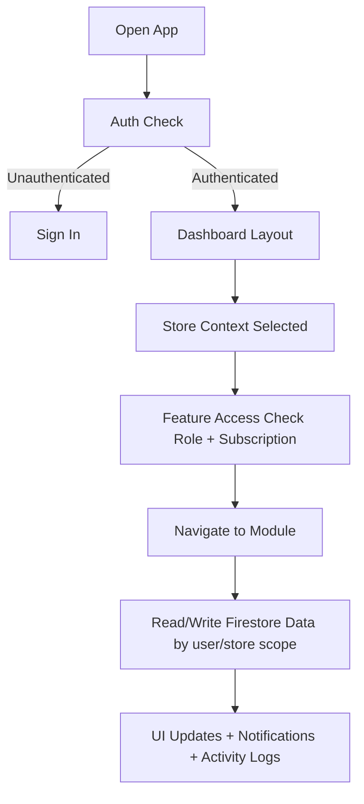
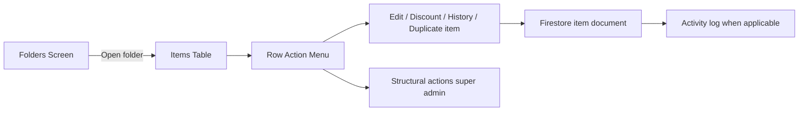
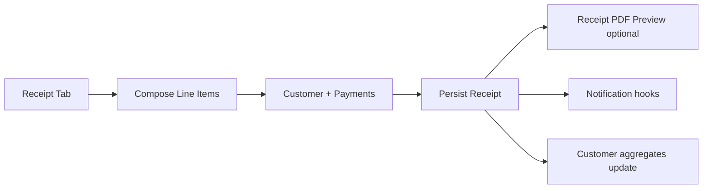

# Storvv App Flow Documentation

This document is a **deep, reader-friendly map** of how Storvv works from the moment someone opens the app through daily operations. It is written for:

- **Owners and operators** who want to understand what the product does end to end, without reading code.
- **Support and onboarding** teams who need plain-language explanations of flows and limits.
- **Developers** who need a single place that ties user journeys to modules, stores, Firestore scoping, and key files.

Whenever this doc says **“the active store”** or **“current branch”**, it means the store selected in the **header store switcher** (for super admins) or the store **assigned to that staff member**. Almost every list and form in the dashboard reads and writes data **only for that store**, unless a screen is explicitly built for cross-store tools (for example Multi-Store Sync on Enterprise).

Terms used here:

- **Super admin** = account owner who created the Storvv workspace. Full structural control (folders, settings, staff creation, some destructive actions).
- **Manager** = staff role with broader edit powers (for example receipts/refunds where the app allows).
- **Staff** = standard team member, often read-only on structure, day-to-day selling and viewing.
- **Plan** = Micro, Medium, or Enterprise subscription; it **unlocks** sidebar items and caps (stores, departments, staff counts, etc.).

---

## 1) Product Purpose (What Storvv Is For)

Storvv is built for **retail and similar operations** where you must know **what you have**, **what you sold**, and **who touched what**. Below is what each focus area means in practice inside the app.

### Inventory management (folders, items, stock movement)

- **Folders** are your **categories with a schema**: each folder has a **template** (custom fields like brand, serial, color, price). Think “Toyota cars” or “Phone accessories” as **containers**, not a physical bin.
- **Items** are rows inside a folder: one row per product (or per serial line, if the folder uses serial tracking).
- **Stock movement** mainly happens when **receipts complete**, **refunds/returns** run, or super admins adjust data. The app is designed so quantities and availability stay tied to real sales activity rather than silent manual drift.

### Receipts and sales tracking

- Sales are recorded as **receipts** (the Sales / Receipts area of the app). A receipt links **line items**, **totals**, **customer** (optional but encouraged), **payment method**, and **status** (for example completed vs pending).
- Receipts drive **revenue views**, **customer history**, and **inventory updates** when the business rules say an item is sold or returned.

### Returns and refunds workflow

- Returns are tied to **specific receipts**, not free-floating. That keeps accounting and stock **reversible in an auditable way**: you know which sale you unwound.
- Who can trigger refunds depends on **role**; super admins have the widest ability to delete or correct (see Authorization).

### Customer records

- Customers can be captured **at checkout** (name, phone, email). Over time the **Customers** tab aggregates **who bought what** without maintaining a separate spreadsheet.

### Security and audit visibility (Activity Logs)

- Important actions (inventory and operational events) can produce **activity log** entries: **who** did **what**, on **which entity**, roughly **when**.
- This is **Medium or Enterprise** territory (not on Micro) and is restricted by **role** so random staff do not see the full audit trail unless your product rules allow it.

### Notifications for key events

- The **bell** in the header surfaces **in-app notifications**: sales, alerts, and other operational signals. There is also a full **notifications** route for a dedicated feed.
- The client applies **retention** (for example notifications older than **24 hours** may be dropped from the local list on fetch) so the panel stays usable. This is **UI/store behavior**, not a substitute for long-term legal archives.

### Multi-store operations (plan and role dependent)

- **Medium and Enterprise** support **multiple store locations** (with different caps; Enterprise is positioned for unlimited scale in marketing).
- Each store has its **own** inventory folders, items, receipts, customers, departments, and staff assignment. You **switch stores** as super admin to work in a different branch.

### Copy from branch (Enterprise, super admin only)

- If you run **more than one branch**, you can **reuse folder blueprints** from an existing branch onto another: **Copy from branch** on the **Inventory Folders** page. It copies **templates and folder settings**, **not** stock. This is documented in depth under **Inventory Flow** below.

---

## 2) High-Level User Flow (From Open App to Working)

At the highest level, every session follows the same rhythm: **prove identity**, **resolve which store you are in**, **check what you are allowed to open**, then **load and save data** under that scope.

### Plain-language walkthrough

1. **Open app:** the client loads (Nuxt/Vue). Firebase Auth state is observed.
2. **Not signed in:** routes point you to **sign-in** (or sign-up flows if you expose them). No store data should load for anonymous users.
3. **Signed in:** the app loads **user profile** (`user` store) so it knows **role** (super admin vs staff) and **subscription** (Micro/Medium/Enterprise).
4. **Dashboard shell appears:** sidebar, header, and the current page slot. This shell is **shared** across modules (`layouts/dashboard.vue`).
5. **Store context resolves:**
   - **Super admin:** the app remembers or picks a **current store** (header selector, persisted preference, or first available store depending on initialization logic).
   - **Staff:** the store usually comes from the **staff record** (their assigned branch). They do not pick arbitrary branches unless your product evolves to allow it.
6. **Feature gates run:** sidebar links and buttons **hide or disable** if the plan or role forbids them (examples: Analytics, Activity Logs, Multi-Store Sync, Copy from branch).
7. **You open a module page:** that page **fetches** from Firestore (or caches in Pinia) using paths scoped to **effective owner user id** and **current store id**.
8. **You perform an action:** writes go through store actions (`stores/*.ts`), rules on the server/Firestore still apply, UI updates locally and may enqueue **toast**, **notifications**, or **activity** side effects depending on action.

### First-time vs returning user

- **First-time** super admins often hit **Onboarding** (currency, country, store details) before the numbers everywhere look correct.
- **Returning users** skip straight to **Dashboard** and their last-used patterns (store selection, pinned flows).

---

## 3) Core Architecture Flow (How the Codebase Mirrors the Product)

Understanding these three layers helps when debugging “the UI looks wrong” versus “the data never arrived” versus “Firestore rejected the write”.

### UI Layer (what users see)

- **`pages/dashboard/*`**: one file (or nested route folder) per main area, for example:
  - `pages/dashboard/inventory/index.vue`: **Folders grid**
  - `pages/dashboard/inventory/[id].vue`: **Inside one folder**, item table and row actions
  - `pages/dashboard/receipts.vue`: **Sales** (Receipts + Customers tabs)
  - `pages/dashboard/analytics.vue`, `activity.vue`, `multi-store-sync.vue`, etc.
- **`layouts/dashboard.vue`**: the **shell** wrapping all of the above: **sidebar**, **top bar**, **store selector**, **global search**, **notifications**, **theme**, **profile** menu.
- **`components/**`**: reusable pieces (modals, tables, receipts, notifications panel, buttons). Heavy feature UI often lives beside `pages/` in a matching folder (`components/receipts/`, `components/inventory/`).

### State Layer (Pinia stores, client-side truth)

Stores **cache server state**, **coordinate loading**, and **enforce UI permissions** before calling Firebase.

| Store (examples)          | What it carries                                                                              |
| ------------------------- | -------------------------------------------------------------------------------------------- |
| `stores/auth.ts`          | Firebase session, UID, listeners                                                             |
| `stores/user.ts`          | Profile doc: role, subscription, display prefs, linked store/customer-facing fields          |
| `stores/stores.ts`        | List of branches, **currentStoreId**, initialization from local persistence                  |
| `stores/inventory.ts`     | Folders for current fetch, paginated/chunked item strategies, CRUD helpers, Copy from branch |
| `stores/receipts.ts`      | Receipt list state, mutations around sales                                                   |
| `stores/customers.ts`     | Customer aggregates as used by Sales screens                                                 |
| `stores/notifications.ts` | Panels feeds, read state, **time-based pruning**                                             |

If a bug “fixes itself on refresh”, suspect **Pinia cache** versus **Firestore** versus **listeners not wired**.

### Data Layer (Firestore and path rules)

- Data lives under hierarchical paths such as **`users/{ownerUid}/stores/{storeId}/...`** for inventory folders, items, receipts, etc. Exact helpers live in composables like `useFirestorePaths` (see codebase).
- **Staff users** reading their manager’s branch typically resolve **`getQueryUserId()`** style helpers so queries hit the **owning super admin’s** tree instead of the staff member’s UID. This is critical: a staff login is still “who you are” for auth, but “where data lives” is often **the store owner’s document tree**.

---

## 4) Authentication and Session Flow (Detailed)

### Step-by-step

1. **Bootstrap:** app starts, Firebase reports current user or null.
2. **Unauthenticated:** navigation guards send you to login. Marketing site (`pages/index.vue`) remains separate from dashboard routes.
3. **Authenticated:** fetch **user document** for role and subscription. Without this, feature flags are unknown and the UI may flash empty or locked states.
4. **Dashboard mount:** layout wraps child route. Side effects include **theme**, **hydrating store list**, and **store selection**.
5. **Store selection:** failing this step strands users on prompts like “select a store” on analytics-style pages because queries need `storeId`.
6. **Child page mounted:** runs its own **`onMounted` / watchers** tied to **`currentStoreId`**. Changing store triggers **refetch** of folders/receipts/customers for the new branch.

### Staff signup edge cases

- During **staff provisioning**, some initialization paths intentionally **defer** loading until the staff document is stable (see stores code comments). Support should know transient “missing store” states can occur if onboarding is interrupted.

---

## 5) Dashboard Shell Flow (Everything Around the Working Area)

Think of the shell as **air traffic control**: it chooses **where** you are (route), **which branch** data applies to (store), and **which global tools** are one click away.

### Sidebar

- Shows **routes** exposed by your subscription.
- Supports **collapse** modes on desktop so power users reclaim width.
- For super admins with **Branches** lists, shortcuts may mirror **Stores** hierarchy (your product may expose department drill-down). Items like **Receipts**, **Analytics**, **Activity**, **Help** obey the same gating logic as Medium/Enterprise docs describe.

### Top navigation

- **Search (global search):** opens a modal; fuzzy lists inventory/receipt/customer shapes depending on sync state. Shortcut keys are hinted in UX (often Cmd/Ctrl+K style).
- **Store selector:** **super admins** switch branches globally. Changing it **reloads downstream module state**.
- **Theme toggle:** local preference (light vs dark vs system). Receipt PDF/export paths historically force a **light** capture so printed views look professional.
- **Notifications:** dropdown panel anchored from the bell.
- **Profile menu:** avatar area leading to Profile, Settings, Sign out flows.

### Overlays and anchoring menus

Floating menus (**folder row actions**, **receipt menus**, notification panel) rely on helpers that position against **anchors** **avoiding clipping** inside scroll containers. If a menu flashes in the wrong place, it is typically **Teleport + fixed positioning**, not broken data.

### Per-store refresh

Many pages **watch `storesStore.currentStoreId`**. Changing store resets filter chips, clears cached lists marked per-folder, etc. Writers of new pages should follow the same pattern to avoid leaking **Branch A ids** onto **Branch B** UI.

---

## 6) Module Flows

This section expands each major product area beyond a one-line gloss.

---

## Inventory Flow

Inventory is intentionally **two levels**: **folders (schema layer)** → **items (data layer)**. Sales always pick **folder first**, then **items inside that folder** on the receipt flow.

### Folders screen (`/dashboard/inventory`)

- **Search/sort/paginate** folder tiles so large chains do not choke the DOM.
- **Super admin** sees **Create folder**, **Bulk delete**, and **Duplicate** flows at folder granularity (plans may gate duplicate features; see Upsell banners on Micro).
- **Copy from branch (Enterprise)** lives here: destination is **whatever branch you are currently viewing**.

### Folder detail (`/dashboard/inventory/[id]`)

- Presents columns derived from folder **template**.
- Handles **duplicate serial** validations for certain flows.
- Offers **timeline/history**, **discounts**, edit restrictions when items are constrained by receipts (business rules enforced in UI and ideally server rules).

### Key outcomes for inventory mutations

- **Stock truth** aligns with receipts and returns.
- Heavy creates use **batching** helpers where implemented (creating many serial lines during duplicate flows, etc.).
- **Activity Logs** ingest messages from operations that call `logActivity`.

---

### Copy from branch (Enterprise, expanded)

Use this subsection as the **canonical** explanation when training someone on multi-branch onboarding.

#### One sentence pitch

Already perfected your templates on **Branch A**? Copy those **layouts** onto **Branch B** in bulk so you stop hand-recreating schemas. **Products and quantities stay put** until you intentionally add inventory on the receiving branch.

#### Eligibility checklist (every condition must align)

| Requirement                   | Why it exists                                                       |
| ----------------------------- | ------------------------------------------------------------------- |
| **Super admin login**         | Only owners may rewrite cross-branch structural data this way       |
| **Enterprise subscription**   | Positioned as a chain-scale convenience                             |
| **Two or more active stores** | There must be somewhere to copy **from**, distinct from destination |
| **Destination chosen first**  | The store switcher sets where new folder docs appear                |

Managers and staff will **never** trigger this pathway in the current product.

#### UI walkthrough (matches on-screen wording)

1. **Choose destination:** header **store picker** selects the branch receiving templates. Confirm the **folders grid behind you** reflects that branch title.
2. Open **Inventory** → **Folders** page.
3. Tap **Copy from branch** beside **New folder**.
4. In the modal:
   - **Source branch** dropdown chooses which existing branch owns the templates shown in the checklist.
   - Wait for **folders to load**. If zero rows:
     - either the chosen source truly contains no folder docs, **or**
     - you misunderstood which branch owns the schemas (remember the checklist is bound to dropdown, **not** the tiles behind overlay).
   - Tick specific folders (`All`, `None`, or individual checkboxes).
   - Choose collision policy (**Skip** duplicates vs **suffix** names with `(copy)` pattern).
   - Confirm the copy count reads correctly on the confirm button label.
5. After success the **folders grid refreshes**. New folders have **zero item counts**.

#### Inclusion and exclusion matrices

**Copied fields (destination gets new IDs on disk)**

| Category   | Detail                                                                                             |
| ---------- | -------------------------------------------------------------------------------------------------- |
| Identity   | Folder **display name**, **description**, optional **type** label                                  |
| Appearance | Folder **color** chip                                                                              |
| Mode       | **`hasSerialNumbers`** toggle                                                                      |
| Template   | Complete field list (**label**, **widget type**, validation, selects, placeholders) cloned as JSON |

**Excluded by design**

| Category                                 | Explanation                                                                                       |
| ---------------------------------------- | ------------------------------------------------------------------------------------------------- |
| Items                                    | SKU rows do not teleport; stocking is always explicit                                             |
| Counts/`itemCount`/values                | Derived metrics reset fresh                                                                       |
| `allowedDepartments`                     | Department identifiers are scoped per store; recreated manually if you rely on departmental locks |
| Historical receipts/customers/taxes/etc. | Unrelated aggregates                                                                              |

#### Compare similar features so users stop mixing them up

| Flow                          | Moves stock?              | Copies folder schema?                                                                | Plan                |
| ----------------------------- | ------------------------- | ------------------------------------------------------------------------------------ | ------------------- |
| **Receipt sale**              | Yes (rules-based)         | No                                                                                   | Core                |
| **Folder Duplicate (single)** | No                        | Copies one folder to new names on **same branch**                                    | Medium + Enterprise |
| **Copy from branch**          | No                        | Copies **chosen** folders from **another** branch onto **currently selected** branch | Enterprise          |
| **Multi-Store Sync**          | Yes via transfer workflow | No                                                                                   | Enterprise          |

#### Developer touchpoints

- **UI orchestration**: `pages/dashboard/inventory/index.vue` (selection state machines, loaders, explanatory copy).
- **Store implementation**: `stores/inventory.ts` methods `fetchFolderTemplatesForStore` and `duplicateFolderTemplatesBetweenStores` (batch writes chunked for Firestore transaction limits).

---

## Receipts Flow (Sales Hub)

Marketing label may still say **Receipts** in sidebar, but conceptual area is **Sales**: receipts pipeline + CRM-like customers grid.

### Receipts tab (table world)

Users search, filter (status/date), fullscreen for dense grids, optionally expand line items summaries per row UI.

### Create receipt wizard

Typically **three beats**:

1. **Pick folder**: inventory availability at **active store**.
2. **Pick items/qty/discount swaps** per business rules including optional **swap-in** capture for trade-ins.
3. **Receipt meta**: buyer info, tender type, statuses, attachments/notes depending on roadmap.

Swap-in lines optionally link to **inventory item creation**, credit math, receipts metadata (see codebase for exact fields exposed on receipt payloads).

### After save

| Path                                | Meaning                                                                                                                        |
| ----------------------------------- | ------------------------------------------------------------------------------------------------------------------------------ |
| **View modal** (`ViewReceiptModal`) | Read-oriented detail, **PDF** triggered manually (does not silently download unless marketing copy says otherwise post-change) |
| **Email receipt** server route      | Sends structured payload optionally with base64 attachments                                                                    |
| **Toast + notifications**           | Human confirmation loops                                                                                                       |
| **Inventory stock** side effects    | When receipt status implies consumptive sale/refund pipelines                                                                  |

Returns happen through **explicit refund/return tooling** anchored on the original receipt identity so traceability survives audits.

---

## Customers Flow

- Data collected at receipt time aggregates into **customers** UX (lifetime spend, receipts count, searchable directory).
- **Customers tab** parallels receipts tab with similar affordances (**pagination/fullscreen**) for large clientele.

---

## Analytics and Reporting (Tiered Availability)

Usually **Medium and Enterprise**:

- KPI cards (revenue, counts, deltas vs previous intervals).
- Charting slices by period presets.
- Export buttons (**PDF**, **Excel** style) guarded by asynchronous spinners blocking double taps.

Selecting store is prerequisite; UX often blocks with friendly prompt.

---

## Activity Logs Flow

- Surfaces chronological **immutable-style** narratives (immutable at least at UI layer; admins should follow internal policy).
- Contains entity labels, timestamps, textual actor names sourced from caches.
- **Role gating**: super admins vs managers permitted; ordinary staff redirected.

---

## Notifications Flow

- **Bell panel** anchored under header triggers.
- Entries include title/body/snippet semantics (see component).
- **Retention**: store logic may prune **stale notices** regularly (currently **approx 24h** window on fetch pipelines; confirm in source if support asks exact rule).
- **Full page notifications route** renders same conceptual list with spacing tuned for readability.

Remember: pruning is **notification feed hygiene**, **not guaranteed archival**.

---

## Multi-Store Sync (Enterprise Super Admin Specialty)

Separate from Copy from branch:

- **Movement of inventory quantities** approved through states (conceptually request→approve→ship/receive semantics as implemented on page).
- **Consolidated reports** across chains.
- **Transfer history**.

Staff without super admin privileges see **blocked** UX.

---

## Settings, Profile, Help, Onboarding

- **Settings**: brand, Paystack linkage, numbering, inventory defaults (**super-admin-only edit** UX).
- **Profile**: persona data, passwords, MFA toggles.
- **Help center**: searchable static knowledge base synced with marketing/feature truth.
- **Onboarding wizard**: onboarding gating prevents inconsistent currency/date displays downstream.

---

## 7) Authorization and Feature Access (Deep Dive)

Access is **`f(role, subscription, storeAssignment)`**. Being logged in ≠ being allowed into every route.

### Role axis

| Capability sample                    | Super admin       | Manager staff             | Regular staff            |
| ------------------------------------ | ----------------- | ------------------------- | ------------------------ |
| Create inventory folders/templates   | Typical yes       | Usually no structural add | View catalog for selling |
| Delete receipts destructive          | Typical yes paths | Depends                   | Denied destructive       |
| Approve receipts edits/refunds paths | Flexible          | Often yes vs standard     | Limited                  |
| Use Multi-Store Sync                 | Yes               | Locked                    | Locked                   |

(Exact allowances should still be validated against Firebase security rules whenever adding new writes.)

### Subscription axis

| Feature cluster                | Micro                | Medium               | Enterprise                  |
| ------------------------------ | -------------------- | -------------------- | --------------------------- |
| Core inventory+sales baseline  | Included             | Included             | Included                    |
| Analytics                      | No                   | Yes                  | Yes                         |
| Activity Logs visibility       | No                   | Yes                  | Yes                         |
| Multiple stores                | Single store framing | Expanded branch caps | Unlimited marketing posture |
| Multi-Store transfers          | No                   | No                   | Yes                         |
| **Copy from branch templates** | No                   | No                   | **Yes**                     |

### Store context axis

Authenticated but **without** `storeId` context cannot load gated analytics pages responsibly. Always confirm store selection troubleshooting steps before debugging Firestore indexes.

Explicit statement: **Copy from branch requires super admin AND Enterprise AND at least two active branches**, enforced both in Vue gating and Pinia store throws.

---

## 8) Data Scoping Model (How Leakage Is Prevented)

### Dual keys in practice

1. **Auth UID** for identity and security rules.
2. **Store document key** for partition of business data.

Staff sessions still query **owner-scoped paths** so someone with staff creds never accidentally reaches another unrelated tenant.

### Practical mental model for developers

Whenever writing a Firestore helper, finish this sentence aloud:

> “This query touches **whose** `users` node and **which** `stores/{id}` slice?”

If unsure, trace `getQueryUserId()`, `currentStoreId`, and security rules mirrored in `/firestore.rules`.

---

## 9) Operational Scenarios (Extended Narratives)

### Scenario A: Green-field store for an owner

1. Sign up Micro or paid tier onboarding wizard.
2. Complete **currency + geography** onboarding.
3. Create **folders** reflecting actual merchandising taxonomy.
4. Import or hand-enter SKUs/items.
5. Train staff logins mapped to departments.
6. First receipt smoke test validates stock decrement correctness.

### Scenario B: Open second branch (Enterprise playbook)

1. Create/activate Branch B inside subscription allowances.
2. Switch store context to Branch B.
3. Run **Copy from branch** sourcing Branch A schemas if templates should match franchise standards.
4. Optionally run **stock transfers** separately through Multi-Store Sync when physical goods move warehouses.
5. Validate department restrictions before go-live openings.

### Scenario C: Busy Saturday sale loop

Staff signs in tied to flagship store. Through shift they:

1. Rapid-build receipts with customer capture when asked.
2. Push pending receipts to completion when tender clears.
3. Monitor low-stock surfaced from receipts usage (analytics/notifications interplay).

### Scenario D: Post-sale audit

Manager opens Activity Logs locating suspicious discount patterns. Optionally cross-opens receipt timeline correlating SKU movement with cashier identity surfaced in timeline modals.

Each scenario reinforces: **routing + store switching** first, transactional pages second.

---

## 10) Suggested Future Enhancements

Cross-links for roadmap brainstorming (non-binding):

- **Server-triggered housekeeping** complements client-side notification pruning so offline devices reconcile.
- **Rich log filters**: multi-select entity types/date bounding beyond current MVP table.
- **Correlation IDs**: propagate deterministic IDs linking receipt commits to originating inventory audits for SOC-style investigations.
- **Server-enforced quotas** aligning marketing plan tables with realtime enforcement reduces edge-case oversubscription disputes.

---

## 11) Quick Reference (Representative Paths)

Copy/paste anchors for debugging tickets:

| Area                             | Primary files                                                                                   |
| -------------------------------- | ----------------------------------------------------------------------------------------------- |
| Dashboard shell chrome           | `layouts/dashboard.vue`                                                                         |
| Folders + Copy from branch       | `pages/dashboard/inventory/index.vue`                                                           |
| Folder item grid                 | `pages/dashboard/inventory/[id].vue`                                                            |
| Sales hub                        | `pages/dashboard/receipts.vue`                                                                  |
| Receipt PDF/email modal heavy UI | `components/receipts/ViewReceiptModal.vue`                                                      |
| Line item receipt detail tables  | `components/receipts/ReceiptTableLineItems.vue`                                                 |
| Notifications panel/page         | `components/notifications/NotificationsPanel.vue`, `stores/notifications.ts`                    |
| Activity listing                 | `pages/dashboard/activity.vue`, `composables/useActivityLog.ts`                                 |
| Store selection                  | `stores/stores.ts`, `components/ui/StoreSelector.vue`                                           |
| Copy templates store math        | `stores/inventory.ts` (`fetchFolderTemplatesForStore`, `duplicateFolderTemplatesBetweenStores`) |

---

## Document hygiene

Keep this Markdown **ASCII punctuation** leaning (prefer simple hyphens in sentences) so support articles and git diffs stay noise-free. Update plan matrices whenever marketing or Paystack SKUs change so CS scripts stay aligned.

**End of document.**
