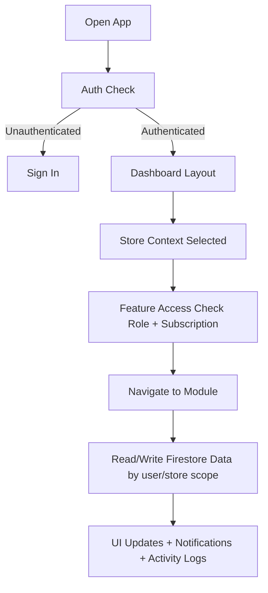
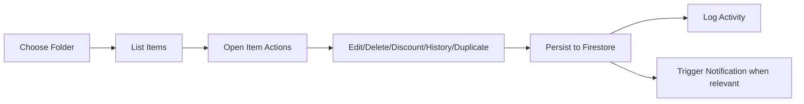
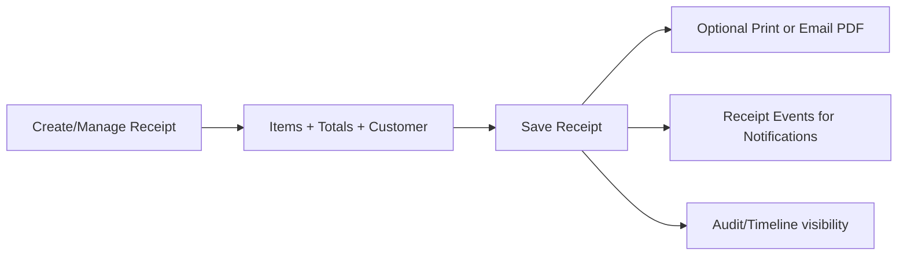

# Storvv App Flow Documentation

This document explains how the Storvv app flows from sign-in to daily operations, including where data comes from, how users move through modules, and how core business events connect across the system.

---

## 1) Product Purpose

Storvv is a retail/store operations app focused on:

- Inventory management (folders, items, stock movement)
- Receipts and sales tracking
- Returns/refunds workflow
- Customer records
- Security/audit visibility (Activity Logs)
- Notifications for key events
- Multi-store operations (plan + role dependent)

---

## 2) High-Level User Flow

---

## 3) Core Architecture Flow

### UI Layer
- `pages/dashboard/*` = module pages (inventory, receipts, analytics, activity, etc.)
- `layouts/dashboard.vue` = persistent shell (sidebar, top nav, search, theme, notifications, profile)
- Shared components live in `components/*`

### State Layer (Pinia Stores)
- `stores/auth.ts` → session/auth lifecycle
- `stores/user.ts` → user profile, permissions context
- `stores/stores.ts` → branch/store selection and scope
- `stores/inventory.ts`, `stores/receipts.ts`, `stores/customers.ts`, etc. → module state
- `stores/notifications.ts` → notifications list/read state + retention

### Data Layer
- Firestore-backed data access with hierarchical scoping by user/store
- Helper composables provide scoped paths and current store context

---

## 4) Authentication & Session Flow

1. App loads and checks auth status.
2. If no session, user is routed to sign-in.
3. If authenticated:
   - user profile is loaded
   - role + subscription are evaluated
   - dashboard shell mounts
4. Store context is initialized (critical for data scoping).
5. Navigation and module data fetching begin.

---

## 5) Dashboard Shell Flow (Global UX)

The dashboard shell controls global app behaviors:

- Sidebar route navigation
- Top navigation actions:
  - global search
  - store selector
  - theme toggle
  - notifications panel
  - profile menu
- Per-store data refresh patterns
- Outside-click and menu anchoring behavior for overlays/menus

---

## 6) Module Flows

## Inventory Flow

Key outcomes:
- Inventory updates affect stock visibility and downstream sales/receipt behavior.
- Item-level actions are tied to activity logging and role constraints.

## Receipts Flow

Key outcomes:
- Receipt creation/refund/update impacts reports, customer views, and notifications.
- Receipt details can be expanded in table/card views for quick operational checks.

## Customers Flow
- Customers are linked to receipts and purchase history.
- Customer-centric pages aggregate receipt behavior and value.

## Activity Logs Flow
- Tracks who did what (action + entity + time context).
- Supports accountability and auditing.
- Typically consumes events from inventory/operational actions.

## Notifications Flow
- Notification events are generated by important business operations.
- Notifications are shown in the top-nav panel and notifications page.
- Read/unread behavior is tracked.
- Retention: old notifications are cleaned out after defined window (24h in current logic).

---

## 7) Authorization & Feature Access

Feature visibility is controlled by:

- Role (super admin, manager, staff)
- Subscription plan capabilities
- Current store context

This means a user can be authenticated but still blocked from specific modules (e.g., Activity Logs or Multi-store features) if role/plan rules do not permit access.

---

## 8) Data Scoping Model

Most data operations are scoped by:

- effective user identity (including super-admin context for staff)
- selected store/branch

This prevents cross-store leakage and ensures all lists/actions reflect only the active store context.

---

## 9) Typical End-to-End Operational Scenario

1. User signs in.
2. Dashboard initializes with selected store.
3. User opens Inventory folder and updates an item.
4. Update is saved to Firestore.
5. Activity log records the action.
6. Related notifications are created (if configured by action type).
7. User creates receipt using updated item.
8. Receipt appears in receipts module, analytics, and customer history.
9. User opens top-nav notifications to review events.

---

## 10) Suggested Future Enhancements

- Add server-side scheduled cleanup for retention-based records (extra safety beyond client-triggered cleanup).
- Add activity log filters (action/user/entity/date range) for faster audit workflows.
- Add event correlation IDs across modules (inventory action → receipt event) for deeper traceability.

---

## 11) Quick Reference (Key App Areas)

- Shell/Layout: `layouts/dashboard.vue`
- Main modules: `pages/dashboard/*.vue`
- State stores: `stores/*.ts`
- Notifications: `components/notifications/NotificationsPanel.vue`, `stores/notifications.ts`
- Receipts UI/PDF: `components/receipts/*`, `pages/dashboard/receipts.vue`
- Activity logs: `pages/dashboard/activity.vue`, `composables/useActivityLog.ts`

