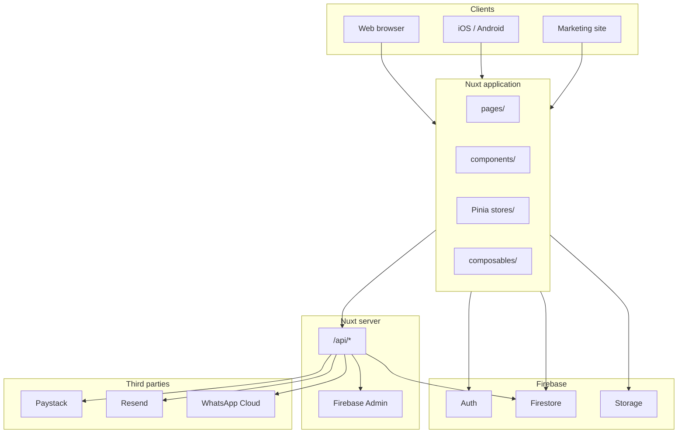

# Storvv — Complete Product & Technical Guide

This is the **master reference** for Storvv: what the product is, who it serves, how every module works, how data is stored, how access is enforced, and how the codebase is organized.

**Audience:** owners, operators, support, onboarding, and developers.

**Companion docs (deeper or specialized):**

| Document | Focus |
| -------- | ----- |
| [HOW_STORVV_WORKS.md](./HOW_STORVV_WORKS.md) | Short architecture overview |
| [STORVV_APP_FLOW.md](./STORVV_APP_FLOW.md) | User journeys with file references |
| [SUBSCRIPTION_FEATURES.md](./SUBSCRIPTION_FEATURES.md) | Plan matrix (kept in sync with code) |
| [DEPLOYMENT.md](../DEPLOYMENT.md) | Hosting and environment variables |
| [STORAGE_SETUP.md](./STORAGE_SETUP.md) | Firebase Storage for uploads |

---

## Table of contents

1. [Product overview](#1-product-overview)
2. [Brand, URLs, and naming](#2-brand-urls-and-naming)
3. [Subscription plans and billing](#3-subscription-plans-and-billing)
4. [Roles, permissions, and access control](#4-roles-permissions-and-access-control)
5. [Core concepts every user should know](#5-core-concepts-every-user-should-know)
6. [Session lifecycle — from open app to logout](#6-session-lifecycle--from-open-app-to-logout)
7. [Dashboard shell and navigation](#7-dashboard-shell-and-navigation)
8. [Onboarding and first-time setup](#8-onboarding-and-first-time-setup)
9. [Inventory — folders, items, and stock](#9-inventory--folders-items-and-stock)
10. [Sales — receipts, customers, and POS flows](#10-sales--receipts-customers-and-pos-flows)
11. [Returns and refunds](#11-returns-and-refunds)
12. [Customer balance (Medium+)](#12-customer-balance-medium)
13. [Analytics and reporting (Medium+)](#13-analytics-and-reporting-medium)
14. [Activity logs (Medium+)](#14-activity-logs-medium)
15. [Departments and staff](#15-departments-and-staff)
16. [Stock loans / seller loans (Enterprise)](#16-stock-loans--seller-loans-enterprise)
17. [Multi-store sync (Enterprise)](#17-multi-store-sync-enterprise)
18. [Payment links](#18-payment-links)
19. [Notifications and help center](#19-notifications-and-help-center)
20. [Settings, profile, and branding](#20-settings-profile-and-branding)
21. [Public pages — shared receipts and payment checkout](#21-public-pages--shared-receipts-and-payment-checkout)
22. [WhatsApp and email delivery](#22-whatsapp-and-email-delivery)
23. [Demo mode](#23-demo-mode)
24. [Data model (Firestore)](#24-data-model-firestore)
25. [Security model](#25-security-model)
26. [System architecture](#26-system-architecture)
27. [Server APIs (`/api/*`)](#27-server-apis-api)
28. [Middleware and routing](#28-middleware-and-routing)
29. [UI design system and overlays](#29-ui-design-system-and-overlays)
30. [Web, mobile, and deployment](#30-web-mobile-and-deployment)
31. [Repository map](#31-repository-map)
32. [Glossary](#32-glossary)

---

## 1. Product overview

### What Storvv is

Storvv is a **retail operations platform** for businesses that need to track:

1. **What is in stock** — organized inventory with custom fields per product category.
2. **What was sold** — receipts (sales records) with line items, payments, and customers.
3. **Who did what** — roles, activity logs, and notifications for operational visibility.

It is aimed at store owners, managers, and front-line staff. A single **account owner** (super admin) can run one store on Micro or scale to multiple branches on Medium and Enterprise.

### What problems it solves

| Problem | Storvv answer |
| ------- | ------------- |
| Spreadsheets for stock | Folder templates + item tables per category |
| Lost sales history | Receipts tied to items and customers |
| No audit trail | Activity logs (Medium+) and immutable log rules |
| Multiple branches | Store switcher, copy templates, transfers (Enterprise) |
| Serial inventory on loan | Stock loans module (Enterprise) |
| Staff with limited access | Roles, departments, inventory flags |

### Technology summary

| Layer | Stack |
| ----- | ----- |
| Frontend | Nuxt 4, Vue 3, Pinia, Tailwind CSS |
| Delivery | Static SPA (no SSR); Capacitor for iOS/Android |
| Auth | Firebase Authentication |
| Database | Cloud Firestore |
| Files | Firebase Storage (+ optional Cloudinary for logos) |
| Server | Nuxt Nitro server routes + Firebase Admin SDK |
| Billing | Paystack (NGN) |
| Email | Resend |
| WhatsApp | Meta Cloud API (optional) or device share sheet |
| Hosting | Vercel (web + serverless API) |

---

## 2. Brand, URLs, and naming

| Name | Meaning |
| ---- | ------- |
| **Storvv** | Product and brand (`storvv.com`) |
| **storv-ui** | This repository and npm package name |
| **com.storv.app** | Native iOS/Android app identifier (Capacitor) |

**Typical hosts:**

| Host | Purpose |
| ---- | ------- |
| `www.storvv.com` / marketing hosts | Landing, pricing, legal pages |
| `app.storvv.com` | Authenticated dashboard application |
| `localhost:3000` | Local development |

Subdomain routing is handled in `middleware/00-subdomain.global.ts` (marketing vs app).

---

## 3. Subscription plans and billing

Plans unlock **features** and **numeric caps**. Source of truth: `types/subscription.ts` and [SUBSCRIPTION_FEATURES.md](./SUBSCRIPTION_FEATURES.md).

### Plan IDs

| Plan ID | Display name |
| ------- | ------------ |
| `storvv_micro` | Storvv Micro |
| `storvv_medium` | Storvv Medium |
| `storvv_enterprise` | Storvv Enterprise |

### Numeric limits

| Limit | Micro | Medium | Enterprise |
| ----- | ----- | ------ | ---------- |
| Stores | 1 | 2 | Unlimited (`-1`) |
| Departments per store | 1 | 10 | Unlimited |
| Staff per store | 2 | 25 | Unlimited |
| WhatsApp sends / month | 10 | Unlimited | Unlimited |

**Downgrade behavior:** when a plan allows fewer stores than exist, `getEligibleStoresForPlan()` keeps the **oldest** stores (by `createdAt`); others are hidden from the switcher until upgrade.

### Feature matrix

| Feature | Micro | Medium | Enterprise |
| ------- | :---: | :----: | :--------: |
| Dashboard, inventory, receipts, returns, customers | ✓ | ✓ | ✓ |
| Settings, profile, notifications, help, onboarding | ✓ | ✓ | ✓ |
| WhatsApp messaging | ✓ (capped) | ✓ | ✓ |
| Payment links (nav; see §18 for launch status) | ✓ | ✓ | ✓ |
| Analytics & exports | — | ✓ | ✓ |
| Activity logs | — | ✓ | ✓ |
| Departments (multi-dept teams) | — | ✓ | ✓ |
| Customer balance / credit ledger | — | ✓ | ✓ |
| Duplicate category (same branch) | — | ✓ | ✓ |
| Multi-store sync & transfers | — | — | ✓ |
| Copy from branch (templates) | — | — | ✓ |
| Stock loans | — | — | ✓ |
| Priority support | — | — | ✓ |

### Never paywalled (all plans)

- Create receipts, returns, and customers
- Full inventory for the active branch
- Email receipt delivery (when configured)
- Dark mode, web + mobile apps
- Sign-in, password change, 2FA (profile)
- Help center and onboarding

### Billing flow (Paystack)

1. Owner opens **Settings → Subscription** and selects a plan.
2. Client calls `/api/paystack/initialize` with Firebase ID token.
3. User completes Paystack checkout (NGN).
4. `/api/paystack/verify` or webhook updates `users/{uid}.subscription`.
5. UI re-reads plan via `useSubscriptionFeatures()`.

Plan amounts are validated server-side in `server/utils/paystack-validation.ts` (kobo amounts from env).

### Upgrade moments (UX)

Show upgrade prompts when users **hit a limit**, not randomly:

| Moment | Message direction |
| ------ | ----------------- |
| Analytics nav (Micro) | Revenue trends on Medium |
| 3rd staff invite (Micro) | Medium supports up to 25 staff |
| 2nd store (Micro) | Second branch on Medium |
| WhatsApp cap (Micro) | Unlimited on Medium |
| Copy from branch | Enterprise cross-branch templates |
| Stock loans nav | Enterprise serial lending |

---

## 4. Roles, permissions, and access control

Access is a function of **role**, **subscription plan**, and **active store**.

### Account roles (`UserData.role`)

| Role | Typical user |
| ---- | ------------ |
| `superAdmin` | Account owner who signed up |
| `staff` | Invited team member |

(Legacy types `admin` / `user` may exist in types but primary flows use the above.)

### Staff roles (`Staff.role`)

| Role | Description |
| ---- | ----------- |
| `manager` | Broader edit on sales and operations |
| `staff` | Day-to-day selling and viewing |
| `intern` | Limited staff tier |

**Special flag:** `canManageInventory: boolean` — owner-granted full inventory edit without super-admin login.

### Client permissions (`usePermissions.ts`)

| Capability | Super admin | Manager | Staff (no inventory flag) |
| ---------- | :---------: | :-----: | :-----------------------: |
| Structural manage (`canManage`) | ✓ | ✓ | ✗ |
| Create receipts | ✓ | ✓ | ✓ |
| Edit receipts | ✓ | ✓ | ✗ |
| Delete receipts | ✓ | ✗ | ✗ |
| Manage inventory items | ✓ | if flag | if flag |
| Create inventory folders | ✓ | if flag | if flag |
| Create / remove / move staff | ✓ | ✗ | ✗ |
| Grant inventory access | ✓ | ✗ | ✗ |
| Read-only mode | ✗ | ✗ | ✓ (unless manager or flag) |

### Navigation gating (`layouts/dashboard.vue`)

| Nav item | Plan feature | Extra role gate |
| -------- | ------------ | --------------- |
| Dashboard, Inventory, Receipts, Help, Settings, Profile | respective feature | — |
| Payment links | `payment_links` | — |
| Stock loans | `seller_loans` | Manager or super admin |
| Departments | `departments` | Manager or super admin |
| Analytics | `analytics` | — |
| Activity logs | `activity_logs` | Manager or super admin |
| Multi-Store Sync | `multi_store_sync` | Super admin only |

---

## 5. Core concepts every user should know

### Active store (branch context)

Almost all dashboard data is scoped to the **currently selected store**.

- **Super admin:** picks branch in header **store switcher**; preference stored in `localStorage.currentStoreId`.
- **Staff:** usually bound to one assigned store from their staff record.

When the active store changes, Pinia stores refetch folders, items, receipts, customers, etc.

### Inventory folders and items

Two levels:

1. **Folders (categories)** — define a **template**: custom columns (brand, serial, price, color, …).
2. **Items** — rows inside a folder; one row per product or per serial line.

**Serial mode** (`hasSerialNumbers: true`): each serial is its own row; bulk add accepts many serials at once.

**Quantity mode** (`hasSerialNumbers: false`): a quantity field tracks stock count.

Stock is driven primarily by **sales, returns, balance-due completion, loans, and transfers** — not silent manual quantity drift.

### Receipts (sales)

A **receipt** records line items, totals, optional customer, payment method, and **status**:

| Status | Meaning |
| ------ | ------- |
| `completed` | Sale finalized; stock updated |
| `pending` | Sale recorded but not finalized |
| `balance_due` | Partial payment; balance remains |
| `refunded` | Return processed |
| `cancelled` | Voided sale |

### Data ownership (owner tree)

Business data lives under the **account owner's** Firestore path:

`users/{ownerUid}/stores/{storeId}/...`

Staff authenticate with their own Firebase UID, but queries resolve to the owner's tree via `getQueryUserId()`. This isolates tenants and lets staff work on the correct branch.

### Departments (Medium+)

Departments organize teams. Folders can restrict access via `allowedDepartments[]`. Staff belong to one department per store.

---

## 6. Session lifecycle — from open app to logout

```mermaid
flowchart TD
    A[Open app] --> B{Firebase session?}
    B -->|No| C[Sign in / Sign up / Marketing]
    B -->|Yes| D[Load user profile]
    D --> E[Resolve subscription + role]
    E --> F[Initialize active store]
    F --> G{Onboarding complete?}
    G -->|No| H[/dashboard/onboarding]
    G -->|Yes| I[Dashboard shell]
    I --> J[User picks module]
    J --> K[Read/write Firestore scoped to store]
    K --> L[Toasts, notifications, activity logs]
```

**Step detail:**

1. **Bootstrap** — `stores/auth.ts` listens to Firebase Auth.
2. **Middleware** — `auth.global.ts` blocks dashboard routes if unauthenticated.
3. **Profile** — `stores/user.ts` loads role, subscription, onboarding flags.
4. **Store context** — `stores/stores.ts` → `initializeCurrentStore()`.
5. **Staff password** — if `mustChangePassword`, redirect to `/dashboard/change-password`.
6. **Parallel fetch** — folders, receipts, departments, staff (role-dependent).
7. **Logout** — clears session; store caches cleared.

---

## 7. Dashboard shell and navigation

**File:** `layouts/dashboard.vue`

### Web layout

- **Sidebar** — collapsible (icon rail ~72px or full ~256px).
- **Top nav** — store switcher (super admin), global search (⌘K / Ctrl+K), notifications bell, theme toggle, profile menu.
- **Main content** — page slot with dashboard card/table styling.

### Native layout (Capacitor)

- **Bottom navigation** — `DashboardNativeBottomNav.vue`.
- **No sidebar drawer** — primary routes in tab bar; "More" sheet for secondary items.
- **Overlay host** — `#dashboard-native-overlay-host` for modals and side drawers.

### Sidebar shortcuts

- Recent inventory folder links (up to 5).
- Branches tree with departments/staff drill-down (plan/role dependent).

### Global search

**Component:** `components/search/GlobalSearch.vue`

- Opens with ⌘K / Ctrl+K.
- Searches receipts, inventory items, customers (scoped to active store).
- Saved searches (Medium+ patterns in search store).

---

## 8. Onboarding and first-time setup

**Route:** `/dashboard/onboarding`

**Two steps:**

1. **Locale** — currency and country (drives money/date formatting app-wide).
2. **First branch** — store name, address, phone, email, description.

On completion:

- `hasCompletedOnboarding: true` on user doc.
- First store created under `users/{uid}/stores/`.
- User lands on dashboard with correct formatting everywhere.

---

## 9. Inventory — folders, items, and stock

### Routes

| Route | Purpose |
| ----- | ------- |
| `/dashboard/inventory` | Folder grid/table |
| `/dashboard/inventory/[id]` | Items inside one folder |

### Folder list (`inventory/index.vue`)

**Actions (super admin / permitted manager):**

- Create / edit category (side drawer).
- Delete / bulk delete categories.
- **Duplicate category** (Medium+, same branch) — clones template settings.
- **Copy from branch** (Enterprise, super admin, ≥2 stores) — see below.
- Import/export Excel templates (where enabled).

**Views:** grid cards or table; search, department filter, sort, pagination.

### Create / edit category drawer

**Fields:**

- Name, type (general, electronics, clothing, automotive, …), description.
- **Use serial numbers** toggle.
- **Department access** (optional checkboxes; empty = all departments).
- **Table template** — column definitions with types: `text`, `number`, `date`, `select`, `boolean`, `currency`.

**Template field shape:**

```ts
{
  id, name, label,
  type: 'text' | 'number' | 'date' | 'select' | 'boolean' | 'currency',
  required: boolean,
  options?: string[],
  placeholder?: string
}
```

### Folder detail (`inventory/[id].vue`)

**Table:** columns from folder template + system columns (availability, dates, actions).

**Row actions:**

- View history (`ItemTimelineModal`).
- Apply discount (`DiscountModal`, `BulkDiscountModal`).
- Edit / delete item (side drawer).
- Duplicate item (Medium+ for serial folders).

**Availability / locking:**

- Items **sold** or on **stock loan** cannot be edited or deleted.
- Status shown via `InventoryStatusBadge`.

### Add / edit item drawer

Shared `SidePanel` for add and edit:

- **Single item mode** — all template fields in a grid.
- **Bulk serial mode** — shared product details + list of serial numbers; each serial creates one item.
- Footer: Cancel + Add Product / Update Product.

**System fields (not editable in form):** `id`, `folderId`, `dateIn`, `dateOut`, loan fields, discount metadata, audit timestamps.

### Copy from branch (Enterprise)

1. Select **destination** branch in store switcher.
2. Inventory → **Copy from branch**.
3. Pick **source** branch and categories to copy.
4. On name collision: **skip** or **suffix `(copy)`**.
5. Copies: name, description, type, color, `hasSerialNumbers`, full template JSON.
6. Does **not** copy: live items, counts, `allowedDepartments`, historical data.

### Stock movement triggers

| Event | Effect |
| ----- | ------ |
| Receipt completed | Items marked sold (`dateOut`); serial lines unavailable |
| Return / refund | Items restored via `returnItemsToStock()` |
| Balance due paid | Pending sale fields cleared; stock finalized |
| Stock loan created | Loan flags on serial items |
| Loan sold / returned | Loan doc updated; item flags cleared |
| Multi-store transfer complete | Source decremented; destination items created/updated |

---

## 10. Sales — receipts, customers, and POS flows

### Route

**Primary:** `/dashboard/receipts` (tabs: **Receipts** | **Customers**)

Legacy `/dashboard/customers` may redirect or mirror customer views.

### Receipt list

**Filters:** status (All, Completed, Pending, Refunded), date presets (Today, This week, This month).

**Toolbar actions:**

- **New receipt** → `CreateReceiptModal` (3-step side drawer).
- **Quick Sale** → `QuickSaleModal` (centered modal POS).
- Bulk actions where permitted (delete — super admin only).

### Create New Receipt (3 steps)

**Component:** `components/receipts/CreateReceiptModal.vue` (uses `SidePanel` side drawer).

| Step | Content |
| ---- | ------- |
| 1 | Select inventory **category** (folder); search categories |
| 2 | Select **items** and quantities; serial lines individually |
| 3 | **Receipt details** — customer, payment method, status, notes, swap-in, split payments |

**Sell screen note:** branch-level banner from store settings (`sellScreenNote`) shown on steps 2–3 and Quick Sale.

**After save:**

- View receipt modal.
- PDF generation.
- Email via `/api/receipts/send-email`.
- WhatsApp via Cloud API or share sheet.
- Public link via `/api/receipts/share-link` → `/r/[token]`.

### Quick Sale

**Component:** `components/receipts/QuickSaleModal.vue`

- Barcode scanner toggle (camera).
- Manual barcode entry.
- Fast line-item cart.
- Split payment support.
- Same sell screen note banner.

### Receipt document fields

Key fields on `Receipt`:

```ts
receiptNumber, customerName, customerEmail, customerPhone?, customerAddress?
date, items[], itemsCount, total, paymentMethod
status: 'completed' | 'pending' | 'refunded' | 'balance_due' | 'cancelled'
amountPaid?, balanceDue?, payments[]
folderId, itemIds[], storeId, storeBranchName?, storeLogoUrl?
notes?, refundReason?
splitPayments?: { method, amount }[]
isSwapIn?, swapInFolderId?, swapInItemId?, swapInCredit?
createdBy, actualCreator?  // staff attribution
```

### Customers tab

Aggregates buyers from receipts: name, contact, order count, total spent, receipt history.

Customer docs updated on receipt creation (`stores/customers.ts`).

---

## 11. Returns and refunds

**Component:** `components/receipts/ReturnReceiptModal.vue`

**Who can return:** super admin and manager (per permissions).

**Flow:**

1. Open return on a specific receipt.
2. Confirm reason and items.
3. `inventoryStore.returnItemsToStock()` — serial vs quantity restore logic.
4. Receipt updated: `status: 'refunded'`, `refundReason`, notes prefixed `Returned:`.
5. Filter receipts by **Refunded** for audit.

Returns are always tied to an original receipt — no free-floating refunds.

---

## 12. Customer balance (Medium+)

**Feature flag:** `customer_balance`

**Firestore:** `users/{ownerUid}/stores/{storeId}/customerAccounts/{accountId}`

Tracks credit/balance ledger per customer contact; used for payment reminders and balance-due workflows.

**Access:** all store roles can read/create/update per rules; delete owner/manager.

---

## 13. Analytics and reporting (Medium+)

**Route:** `/dashboard/analytics`

**Guard:** `canUse('analytics')` + active store required.

**Periods:** Daily, Weekly, Monthly.

**KPIs (examples):**

- Revenue (+ period-over-period change)
- Sales count
- Average order value
- Low stock signals
- Refund totals

**Exports:** PDF and Excel (async; UI disables button while running).

**Server:** `/api/stores/export-report.post.ts`, consolidated reports for Enterprise.

---

## 14. Activity logs (Medium+)

**Route:** `/dashboard/activity`

**Access:** plan feature + manager or super admin.

**Columns:** User, Activity, Target, Date.

**Rules:** activity log documents are **append-only** in Firestore (`update/delete: false`).

Written via `logActivity()` from inventory and operational actions.

---

## 15. Departments and staff

### Routes

| Route | Purpose |
| ----- | ------- |
| `/dashboard/departments` | Department list |
| `/dashboard/departments/[id]` | Department detail + staff |
| `/dashboard/stores/[storeId]/departments` | Branch departments admin |

### Department modal

**Side drawer:** create/edit department name, description, core department templates.

### Staff provisioning

1. Super admin creates staff in department UI (email + temporary password).
2. Client creates Firebase Auth account + Firestore staff doc + `members/{authUid}` doc.
3. `sessionStorage.staff_creation_in_progress` preserves owner session during creation flow.
4. Staff first login: `mustChangePassword` → `/dashboard/change-password`.

**Staff document:**

```ts
firstName, lastName, email, phone?, departmentId, storeId, position
role: 'manager' | 'staff' | 'intern'
canManageInventory?: boolean
status: 'active' | 'inactive' | 'on_leave'
authUid?, mustChangePassword?, createdBy, timestamps
```

**Server lifecycle:** `/api/staff/deactivate.post.ts`, `/api/staff/reactivate.post.ts` (Firebase Admin).

---

## 16. Stock loans / seller loans (Enterprise)

**Route:** `/dashboard/seller-loans`

**Nav label:** Stock loans

**Access:** `seller_loans` plan + manager or super admin.

### Concepts

Lend **serial-tracked** inventory to external parties until **returned** or **sold**.

**Loan statuses:** `active` | `returned` | `sold`

### Create loan

1. Select serial rows from inventory.
2. Enter borrower `partyName`, `partyPhone`, `partyNotes`.
3. Items flagged with loan fields; loan doc in `sellerLoanOuts/`.

### Row actions

- **Mark sold** (off-POS).
- **Return to store**.

### Receipt integration

Selling a loaned serial on Create Receipt or Quick Sale marks it sold, clears loan flags, updates `sellerLoanOuts`.

### Limits

Batch cap: `SELLER_LOAN_OUT_BATCH_CAP = 450` writes per operation.

Multi-store transfer warns/blocks loaned serial lines.

---

## 17. Multi-store sync (Enterprise)

**Route:** `/dashboard/multi-store-sync`

**Access:** super admin + `multi_store_sync`.

### Tabs

| Tab | Purpose |
| --- | ------- |
| Transfer items | Request and approve stock moves between branches |
| Consolidated reports | Cross-branch performance |
| Transfer history | Audit of past transfers |

### Transfer workflow

| Status | Meaning |
| ------ | ------- |
| `pending_approval` | Awaiting approver |
| `approved` | Approved, not shipped |
| `in_transit` | Optional carrier/tracking |
| `completed` / `completed_partial` | Stock applied at destination |
| `partial` | Partial fulfillment |
| `rejected` / `cancelled` | Not completed |

**Storage:** `users/{ownerUid}/storeTransfers/{transferId}`

**Server validation:** `/api/stores/transfer-items.post.ts` (client executes Firestore writes after validation).

---

## 18. Payment links

**Route:** `/dashboard/payment-links`

**Feature flag:** `payment_links` (all plans in code).

**Launch status (as of codebase):**

```ts
// utils/payment-links-launch.ts
PAYMENT_LINKS_COMING_SOON = true        // dashboard page shows Coming Soon
PAYMENT_LINKS_NATIVE_COMING_SOON = true // native nav badges
PAYMENT_LINKS_MARKETING_STATUS = 'In progress'
```

When `PAYMENT_LINKS_COMING_SOON` is false, full UI enables:

- Create Paystack payment links with locked amounts.
- Public checkout at `/pay/[token]`.
- Link TTL: **60 minutes**.
- Statuses: `unpaid` | `paid` | `failed` | `expired`.
- Platform fee via `PAYMENT_LINK_PLATFORM_FEE_PERCENT`.
- Merchant bank connect APIs under `server/api/payment-links/`.

---

## 19. Notifications and help center

### Notifications

**Bell dropdown** + full page `/dashboard/notifications`.

**Store:** `stores/notifications.ts`

- Fetches from `users/{ownerUid}/stores/{storeId}/notifications/`.
- Client retention: entries older than **24 hours** may be pruned on fetch (UI usability, not legal archive).

### Help center

**Route:** `/dashboard/help`

Searchable categories mirroring product areas: getting started, inventory, sales, analytics, departments, multi-store, settings, profile.

Content in `pages/dashboard/help.vue` is the in-app source for operator documentation.

---

## 20. Settings, profile, and branding

### Settings (`/dashboard/settings`) — super admin

- Branch create/edit/delete (plan limits apply).
- Subscription and Paystack billing.
- Store-level sell screen notes.
- Receipt prefix / next number (where configured in store settings nested docs).

### Profile (`/dashboard/profile`)

- Name, photo, contact.
- **Two-factor authentication** setup (`TwoFactorSetup.vue`).
- Password change.
- Receipt terms: sales terms, refund policy, warranty policy (used on PDFs).
- Account logo for receipts (`storeLogoUrl` on user or store).

### Theming

**Store:** `stores/theme.ts` — light / dark / system.

Receipt PDF capture forces light theme for readable output.

---

## 21. Public pages — shared receipts and payment checkout

| Route | Auth | Purpose |
| ----- | ---- | ------- |
| `/r/[token]` | None | Public shared receipt view |
| `/pay/[token]` | None | Payment link checkout |

**Receipt share:** token generated server-side; payload via `/api/receipts/share/[token].get.ts`.

---

## 22. WhatsApp and email delivery

### Email

- **Resend** via `/api/receipts/send-email.post.ts`.
- Requires `RESEND_API_KEY` and `RESEND_FROM_EMAIL`.

### WhatsApp

- **Feature:** `whatsapp_messaging`.
- **Usage doc:** `users/{ownerUid}/whatsappUsage/{YYYY-MM}` with count field.
- **APIs:** `/api/whatsapp/usage.get.ts`, `/api/whatsapp/record-send.post.ts`.
- **Micro cap:** 10 sends per calendar month.
- **Fallback:** device share sheet when Cloud API env vars absent.

**Component:** `components/whatsapp/SendWhatsAppModal.vue`

---

## 23. Demo mode

**Routes:** `/demo`, `/demo/*`

Demo uses isolated demo bridge (`utils/demo-bridge.ts`) to simulate Firestore operations without touching production data.

Useful for sales demos and onboarding tours (`components/Tutorial.vue`).

---

## 24. Data model (Firestore)

### Hierarchy

```
users/{ownerUserId}/
  storeTransfers/{transferId}
  storeSyncs/{syncId}
  whatsappUsage/{YYYY-MM}
  pendingCheckouts/{reference}
  stores/{storeId}/
    members/{memberAuthUid}
    departments/{departmentId}/
      staff/{staffId}
    inventoryFolders/{folderId}
    inventoryItems/{itemId}
    receipts/{receiptId}
    customers/{customerId}
    customerAccounts/{accountId}
    notifications/{notificationId}
    activityLogs/{logId}
    sellerLoanOuts/{loanId}
```

**Path helpers:** `composables/useFirestorePaths.ts`

### Store document

```ts
id, name, description?, address?, phone?, email?
sellScreenNote?       // cashier banner
logoUrl?, ownerId, isActive, createdAt, updatedAt?
```

### User document

```ts
uid, email, name, role, subscription
photoURL?, storeLogoUrl?
storeDetails?, preferences?
hasCompletedOnboarding, hasCompletedTutorial?
mustChangePassword?, twoFactorEnabled?, twoFactorMethod?
```

### Inventory item (dynamic + system)

Template-defined fields plus:

```ts
folderId, storeId
dateIn?, dateOut?
pendingSaleReceiptId?, pendingSaleAt?
sellerLoanOutId?, sellerLoanPartyName?, sellerLoanPartyPhone?, sellerLoanOutAt?
swapIn?, swapInReceiptId?
discountPercentage?, discountAmount?, originalPrice?, discountedPrice?
createdBy, createdAt, updatedAt?
```

---

## 25. Security model

**Files:** `firestore.rules`, `storage.rules`

### Membership index

`users/{userId}/stores/{storeId}/members/{memberAuthUid}`

Fields: `status: 'active'`, `role: manager|staff|intern`

### Summary table

| Resource | Read | Create | Update | Delete |
| -------- | ---- | ------ | ------ | ------ |
| User profile | authenticated | owner | owner | owner |
| Stores | owner or member | owner | owner | owner |
| Inventory folders | store access | **owner only** | owner | owner |
| Inventory items | store access | owner | owner or narrow staff sale fields | owner |
| Receipts | store access | owner/manager/staff | role-dependent | **owner only** |
| Seller loan outs | store access | owner/manager | owner/manager/POS reconcile | **never** |
| Activity logs | store access | POS + managers | **never** | **never** |
| Store transfers | owner only | owner | owner | owner |

**Client gates** (`usePermissions`, `useSubscriptionFeatures`) hide UI; **Firestore rules** are the source of truth for writes.

**Staff collection group query:** `{path=**}/staff/{staffId}` where `authUid == request.auth.uid` for staff self-lookup.

---

## 26. System architecture



### Three layers

| Layer | Responsibility | Location |
| ----- | -------------- | -------- |
| UI | Pages, layouts, components | `pages/`, `layouts/`, `components/` |
| State | Cache, loading, client permissions | `stores/`, `composables/` |
| Data | Persistence, security | Firestore, `firestore.rules`, `server/api/` |

### Typical write path

1. User action in Vue component.
2. Pinia store action validates permissions client-side.
3. Firestore write via Firebase SDK (or `/api/*` for privileged ops).
4. Rules enforce server-side authorization.
5. UI updates + optional toast, notification, activity log.

### Native API base

Capacitor builds set `NUXT_PUBLIC_API_BASE` to hosted origin (e.g. `https://app.storvv.com`) so Nitro routes work without bundling the server into the app shell.

---

## 27. Server APIs (`/api/*`)

| Area | Endpoints |
| ---- | --------- |
| Paystack | `initialize.post`, `verify.get`, `webhook.post` |
| Receipts | `send-email.post`, `share-link.post`, `share/[token].get`, `deliver.post`, `delete.post` |
| Payment links | `create.post`, `list.get`, `banks.get`, `connect-bank.post`, `resolve-account.post`, `payout.get`, `settlements.get` |
| Public pay | `pay/[token].get`, `pay/[token]/initialize.post`, `pay/[token]/verify.get` |
| Stores | `transfer-items.post`, `sync-inventory.post`, `export-report.post`, `consolidated-report.post`, `transfer-history.get` |
| Staff | `deactivate.post`, `reactivate.post` |
| WhatsApp | `usage.get`, `record-send.post` |
| Inventory | `validate-serial.post` |
| Storage | `upload-account-logo.post` |
| Utility | `proxy-image.get`, `proxy-image.post` |

**Auth:** `server/utils/store-auth.ts` — `requireAuth`, `requireStoreManageAccess` with Firebase ID token verification.

---

## 28. Middleware and routing

| File | Purpose |
| ---- | ------- |
| `00-subdomain.global.ts` | Marketing vs app host routing |
| `01.capacitor-root.global.ts` | Native: `/` → `/signin` |
| `auth.global.ts` | Dashboard requires auth |
| `auth.ts` | Per-page auth + demo init |
| `guest.ts` | Signed-in users leave guest routes |

---

## 29. UI design system and overlays

Dashboard SaaS styling lives in imported CSS modules (`assets/css/main.css`):

| File | Purpose |
| ---- | ------- |
| `dashboard-shell.css` | Sidebar, topnav, profile |
| `dashboard-cards.css` | Cards, KPI grids, analytics |
| `dashboard-pages.css` | Profile, settings, help |
| `dashboard-tables.css` | Unified tables, hairline dividers |
| `dashboard-overlays.css` | Modals, **side drawers**, toasts |
| `app-buttons.css` | Pill buttons (Storvv navy) |
| `capacitor-native-saas.css` | iOS/Android parity |

### Side drawer (`SidePanel.vue`)

- Slides in from the **right edge** with dimmed backdrop.
- **Unified width** on desktop: `--dashboard-drawer-width` (32rem).
- Full width on mobile/tablet.
- Used for: Create Receipt, inventory add/edit, category create, staff/department forms, branch settings.

### Modal (`Modal.vue`)

- Centered dialog on desktop; bottom sheet on small screens.
- Used for: Quick Sale, delete confirms, discounts, view receipt, WhatsApp send, etc.

### Buttons

**Component:** `components/ui/Button.vue` — pill shape, landing-page navy primary.

---

## 30. Web, mobile, and deployment

### Web

| Surface | Routes |
| ------- | ------ |
| Marketing | `/`, `/privacy`, `/terms`, pricing |
| App | `/dashboard/*`, auth pages |

### Mobile (Capacitor)

- **Build:** `npm run cap:build` → `npm run cap:open:ios` / Android.
- **Config:** `capacitor.config.ts` — `appId: com.storv.app`, `appName: Storvv`.
- Same static bundle as web; bottom nav instead of sidebar.

### Deployment (Vercel)

- Static `nuxt generate` + serverless `/api/*`.
- Env vars: see `.env.example` and [DEPLOYMENT.md](../DEPLOYMENT.md).
- Key public config in `nuxt.config.ts` `runtimeConfig`.

---

## 31. Repository map

| Topic | Path |
| ----- | ---- |
| Routes | `pages/` |
| Dashboard shell | `layouts/dashboard.vue` |
| Pinia stores | `stores/` |
| Firestore paths | `composables/useFirestorePaths.ts` |
| Plans & features | `types/subscription.ts`, `composables/useSubscriptionFeatures.ts` |
| Permissions | `composables/usePermissions.ts` |
| Auth | `stores/auth.ts`, `middleware/auth.global.ts` |
| Security rules | `firestore.rules`, `storage.rules` |
| Server APIs | `server/api/` |
| Receipts UI | `components/receipts/` |
| Inventory UI | `components/inventory/`, `pages/dashboard/inventory/` |
| Capacitor | `capacitor.config.ts`, `plugins/00.capacitor.client.ts` |
| Tests | `tests/README.md` |

---

## 32. Glossary

| Term | Definition |
| ---- | ---------- |
| **Active store** | Currently selected branch; scopes almost all data |
| **Folder / category** | Inventory container with column template |
| **Item** | Product row inside a folder |
| **Receipt** | Sales record |
| **Serial mode** | One Firestore row per serial number |
| **Quantity mode** | Single row with quantity field |
| **Super admin** | Account owner |
| **Owner tree** | Firestore path under owner's UID |
| **Side drawer** | `SidePanel` overlay sliding from right |
| **Copy from branch** | Enterprise template clone across stores |
| **Stock loan** | Enterprise serial lend-out tracking |
| **Balance due** | Partial payment receipt status |
| **Swap-in** | Trade-in credit applied to a sale |

---

## Document maintenance

When shipping a feature:

1. Update `types/subscription.ts` if plan-gated.
2. Update [SUBSCRIPTION_FEATURES.md](./SUBSCRIPTION_FEATURES.md).
3. Add help center entry in `pages/dashboard/help.vue`.
4. Extend this guide's relevant section.
5. Add flow notes to [STORVV_APP_FLOW.md](./STORVV_APP_FLOW.md) if user journey changed.

---

*Last expanded: June 2026 — reflects `storv-ui` codebase including side drawer overlay system, unified drawer width, and payment links coming-soon flags.*
