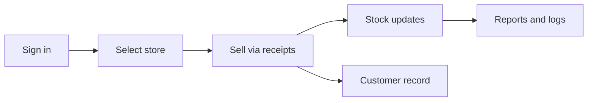

# Storvv — Product Explanation

**Storvv** is a cloud-based platform for retail and store operations. It helps businesses track **inventory**, record **sales**, handle **returns**, manage **customers**, and coordinate **teams** across one or more store locations — from a web browser or mobile app.

- **Website:** [storvv.com](https://www.storvv.com)
- **App:** [app.storvv.com](https://app.storvv.com)
- **Contact:** hello@storvv.com

---

## What problem does Storvv solve?

Most small and mid-size retailers juggle stock in spreadsheets, sales in notebooks or separate POS tools, and customer details in memory or WhatsApp chats. When something goes wrong — a refund, a missing item, a second branch opening — it is hard to answer three basic questions:

1. **What do we have in stock right now?**
2. **What did we sell, and to whom?**
3. **Who on the team made which change?**

Storvv puts those answers in one place, tied to your actual store (or stores), with roles so owners, managers, and staff each see what they need.

---

## Who is Storvv for?

| Audience                     | How they use Storvv                                                                       |
| ---------------------------- | ----------------------------------------------------------------------------------------- |
| **Store owners**             | Set up the business, create branches, manage billing, and control who has access          |
| **Managers**                 | Oversee sales, refunds, teams, and reporting on Medium and Enterprise plans               |
| **Front-line staff**         | Create receipts, look up inventory, and serve customers at the counter                    |
| **Multi-location operators** | Run several branches, copy category templates between stores, and sync stock (Enterprise) |

Storvv is built for **retail and similar operations** — phone shops, fashion, auto parts, general merchandise, procurement-led teams with multiple counters, and any business that needs structured inventory plus sales records.

---

## What can you do in Storvv?

### Inventory

- Organize products in **folders** (categories), each with a custom template (brand, serial number, color, price, and more).
- Track items as **single products** or **serial-numbered** lines, depending on how you sell.
- Stock levels stay aligned with **sales and returns**, so quantities reflect real activity rather than manual guesswork.

### Sales (receipts)

- Record each sale as a **receipt** with line items, totals, payment method, and optional customer details.
- Share receipts by **email**, **WhatsApp** (plan limits apply), or a **public link** customers can open without logging in.
- View and search past sales; filter by status, date, and more.

### Returns

- Process **refunds and returns** linked to the original receipt, so every adjustment is traceable.

### Customers

- Capture buyer name, phone, and email at checkout.
- Build a **customer directory** with purchase history over time.
- On Medium and Enterprise, use **customer balance / credit** features for accounts that pay on credit.

### Team and access

- Invite **staff** with roles: super admin (owner), manager, or staff.
- Organize people into **departments** (Medium+) and control which inventory folders each department can see.
- **Activity logs** (Medium+) show who changed what for accountability.

### Insights and scale

- **Analytics** (Medium+): revenue trends, busy periods, exports.
- **Multiple stores** (Medium: up to 2; Enterprise: unlimited): switch branches in the header and work in the right context.
- **Multi-store sync** (Enterprise): transfer stock between branches and view consolidated reporting.
- **Copy from branch** (Enterprise): reuse category templates from one branch on another without copying live stock.
- **Stock loans** (Enterprise): track serial inventory lent to resellers until sold or returned.

### Notifications and settings

- In-app **notifications** for sales and operational events.
- **Settings** for branding, receipt behavior, and account preferences.
- **Help center** and **onboarding** to set currency, country, and your first store.

---

## How a typical day works

1. **Sign in** — You or your team open the app (web or iOS/Android). Firebase handles secure login.
2. **Choose your store** — Owners with multiple branches pick the active store in the header. Staff usually work in their assigned branch.
3. **Sell** — Create a receipt: pick a category (folder), add items, enter customer and payment details, complete the sale. Inventory updates according to your rules.
4. **Follow up** — Share the receipt, handle a return if needed, check notifications or analytics.
5. **Manage** — Owners adjust folders, invite staff, upgrade the plan, or open a second branch when the business grows.

---

## Subscription plans (summary)

Storvv offers three paid tiers in Nigerian Naira via **Paystack**. Core selling (inventory, receipts, returns, customers) is available on every plan.

| Plan           | Best for                        | Stores    | Highlights                                                                           |
| -------------- | ------------------------------- | --------- | ------------------------------------------------------------------------------------ |
| **Micro**      | Single store, small team        | 1         | Full daily ops; WhatsApp capped at 10 sends/month                                    |
| **Medium**     | Growing business, second branch | Up to 2   | Analytics, activity logs, unlimited WhatsApp, customer balance, duplicate categories |
| **Enterprise** | Chains and multi-location       | Unlimited | Multi-store sync, copy templates across branches, stock loans, priority support      |

For the full feature matrix and limits (staff counts, departments, etc.), see [SUBSCRIPTION_FEATURES.md](./SUBSCRIPTION_FEATURES.md).

---

## Where you can use Storvv

| Platform                 | Description                                                                     |
| ------------------------ | ------------------------------------------------------------------------------- |
| **Web**                  | Full dashboard at the app subdomain; marketing and pricing at the main site     |
| **iOS & Android**        | Same experience in native apps (Capacitor), with mobile-friendly navigation     |
| **Public receipt links** | Customers open `/r/[token]` to view a shared receipt without an account         |
| **Demo**                 | Try the product without signing up via the demo dashboard on the marketing site |

---

## Security and privacy (overview)

- Sign-in uses **Firebase Authentication** (email/password and related flows).
- Business data is stored in **Firebase Firestore**, scoped per account owner and per store.
- **Roles and subscription plans** control what each user can see and do in the app; server-side security rules enforce writes.
- Card payments go through **Paystack**; Storvv does not store full card numbers.
- Details: [Privacy Policy](https://www.storvv.com/privacy) on the live site and `pages/privacy.vue` in this repo.

---

## How Storvv is built (short technical note)

For developers and technical stakeholders:

- **Frontend:** Nuxt 4, Vue 3, Pinia — static SPA deployed on Vercel.
- **Backend data:** Firebase (Auth, Firestore, Storage).
- **Server APIs:** Nuxt Nitro routes for Paystack, receipt email, WhatsApp, and admin tasks.
- **Mobile:** Capacitor wraps the same web app (`com.storv.app`).

Deeper architecture, data paths, and module maps live in [HOW_STORVV_WORKS.md](./HOW_STORVV_WORKS.md). Step-by-step user journeys are in [STORVV_APP_FLOW.md](./STORVV_APP_FLOW.md).

---

## Naming reference

| Name              | Meaning                      |
| ----------------- | ---------------------------- |
| **Storvv**        | Product and brand            |
| **storv-ui**      | This codebase (Nuxt app)     |
| **com.storv.app** | Native app bundle identifier |

---

## Related documentation

| Document                                               | Use when you need…                                    |
| ------------------------------------------------------ | ----------------------------------------------------- |
| [HOW_STORVV_WORKS.md](./HOW_STORVV_WORKS.md)           | Architecture, Firestore model, integrations, repo map |
| [STORVV_APP_FLOW.md](./STORVV_APP_FLOW.md)             | Detailed flows per module, scenarios, file references |
| [SUBSCRIPTION_FEATURES.md](./SUBSCRIPTION_FEATURES.md) | Plan gates, limits, upgrade messaging                 |
| [DEPLOYMENT.md](../DEPLOYMENT.md)                      | Hosting, environment variables                        |
| [STORAGE_SETUP.md](./STORAGE_SETUP.md)                 | Image uploads in Firebase Storage                     |

---

## One-paragraph summary

**Storvv** is retail operations software that unifies inventory, sales receipts, returns, customers, and team access in one cloud app. Owners run one or many stores; staff sell and look up stock in context; plans from Micro to Enterprise unlock analytics, audit trails, and multi-branch tools. It runs on the web and on mobile, bills through Paystack, and keeps each business’s data isolated under the account owner’s workspace.
