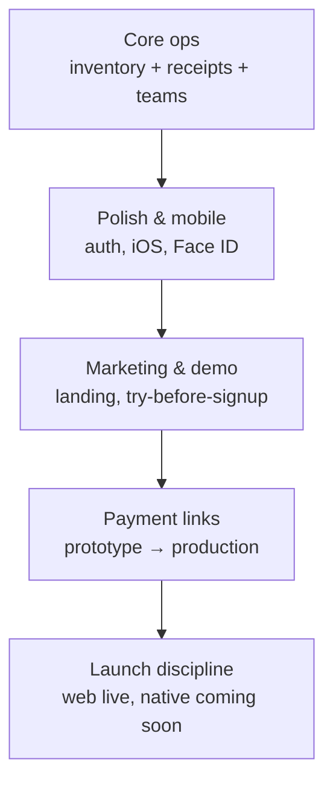

# Storvv - Thought Process & Product Journey

A narrative of how Storvv evolved: what you were trying to build, how your thinking shifted, and the principles that kept showing up in every decision.

_Derived from product conversations, feature work, and design iterations through May-June 2026._

---

## 1. The core idea

Storvv started from a simple frustration every retailer knows:

> **Stock is in one place. Sales are in another. Customers are in WhatsApp. Nobody agrees on the numbers.**

The product was never meant to be “another POS” or “another inventory app.” It was meant to be **one calm workspace** where a shop owner, manager, or staff member could answer three questions without switching tools:

1. What do we have in stock?
2. What did we sell, and to whom?
3. Who changed what?

That framing shaped everything: inventory folders, receipts, returns, customers, departments, multi-store switching, and later payment links. Each feature had to earn its place by helping answer one of those questions - or by helping the business **sell more reliably**.

---

## 2. Who Storvv is for (and how that expanded)

Early marketing leaned gadget/phone-shop language. You corrected that quickly:

> _“Storvv is for any kind of business - cars, spare parts, furniture, clothing, not just gadgets.”_

That was an important product decision. Storvv is **vertical-agnostic retail ops software**:

| Business type                  | How they use Storvv                                     |
| ------------------------------ | ------------------------------------------------------- |
| Phone / electronics shops      | Serial-numbered stock, receipts, low-stock alerts       |
| Fashion & furniture            | Variant fields, categories, customer records            |
| Auto parts & procurement teams | Multi-branch, departments, manager oversight            |
| Growing chains                 | Analytics, activity logs, multi-store sync (Enterprise) |

The landing page, demo copy, and “who it is for” sections were repeatedly tuned to feel **broad but serious** - not niche, not toy-like.

---

## 3. Design philosophy (the thread through everything)

Across auth screens, dashboard, landing page, and iOS, the same standards appeared again and again:

### 3.1 Professional and clean - never “AI slop”

You consistently pushed back on UIs that felt generated or over-decorated:

- Remove long em dashes from marketing copy
- Match blues to the **logo blue** (`#143f8d`)
- Make payment links UI “less AI looking”
- Terms and FAQ: **user-friendly, not technical**
- Security section: professional with **attitude**, not fear-mongering

### 3.2 Readability over cleverness

There was a real tension between “modern = small type” and “readable = normal type.” You landed on:

- **Landing:** brief but explanatory; later pass reduced font sizes for a more professional feel, but you still rejected tiny illegible text when it caused stress
- **App:** uniform text sizes on iOS - inputs, tables, labels all proportioned consistently
- **No clutter:** dashboard info density questioned directly - _“is info on dashboard too much?”_

### 3.3 Mobile is not an afterthought

The Capacitor app had to feel like a **real native product**, not a website in a box:

- Face ID / Touch ID for saved login
- No black letterboxing at top and bottom
- Drawers and panels **inside the app shell**, not floating over the OS chrome
- Floating glass bottom nav (Instagram / Meta style) with side padding - not edge-to-edge
- Uniform typography and spacing across every screen

### 3.4 Trust and calm

Whether onboarding, Paystack settlement UI, or security copy - you wanted users to feel:

> _“This system is serious. My money and my stock are handled properly.”_

That drove settlement summaries on payment links, merchant-bears-fee clarity, and honest “in progress” labels when mobile wasn’t ready yet.

---

## 4. Product phases (how thinking evolved)



### Phase A - Core operations (foundation)

**Belief:** If daily shop work isn’t solid, nothing else matters.

Built and refined:

- Inventory folders with custom templates
- Receipts tied to stock movement
- Returns, customers, departments, roles
- Subscription tiers (Micro → Medium → Enterprise)
- Multi-store context in the header
- Activity logs, analytics, stock loans (Enterprise)

### Phase B - Polish & native app

**Belief:** Merchants will judge Storvv on how it _feels_ on the phone they carry every day.

Priorities:

1. Auth screens that match dashboard quality
2. iOS safe areas, scroll behavior, native chrome
3. Biometric login (with real debugging when Keychain save failed)
4. Side panels and modals that respect the app frame

### Phase C - Marketing & demo-first acquisition

**Belief:** People shouldn’t have to sign up blind.

You wanted:

- A **demo dashboard** that behaves like the real app (localStorage / dummy data, no Firebase)
- Landing page that shows **all features** without overwhelming scroll
- Section order rethink: hero → proof → features → how it works → pricing → FAQ → contact
- Interactive hero, capabilities explorer (dark full-screen tabs), contact & security sections with life
- Slack-inspired neat/light aesthetic (light-dominant with selective dark bands)

### Phase D - Payment links (biggest feature bet)

**Belief:** Remote selling is how many Nigerian retailers already work - WhatsApp, Instagram, DM - but payments are informal and stock doesn’t update.

#### 4.1 Exploration

You explored the full remote-commerce stack:

- Per-item payment links
- Storefront where customers browse inventory themselves
- Share via WhatsApp, Instagram, Facebook, Telegram

#### 4.2 Deliberate narrowing

You cut scope when it didn’t match the real workflow:

> _“Remove the storefront. I just want a link for payment when a customer wants to purchase without visiting the store.”_

**Why:** Storefront implied product photos, catalog maintenance, and a different product (mini e-commerce). Payment links matched how merchants already sell: _“Send me 50k for this item.”_

#### 4.3 Production requirements

Once the dummy UI proved the flow, you asked for everything real:

| Area      | Your requirement                                        |
| --------- | ------------------------------------------------------- |
| Paystack  | Primary provider; subaccounts for merchant settlement   |
| Security  | Server-trusted amounts, webhooks, idempotent settlement |
| Inventory | Auto-deduct on successful payment                       |
| Receipts  | Auto-create sale record after payment                   |
| Expiry    | Unpaid links expire after 1 hour                        |
| Fees      | Merchant bears Paystack fee                             |
| Trust UI  | Show money status (with merchant / settling / paid out) |
| Plans     | Payment links on **all** subscription tiers             |
| Dashboard | Surface payment link activity on home + analytics       |

#### 4.4 Operational reality

You hit real-world Paystack questions:

- Test mode vs live mode
- T+1 settlement (not instant bank credit)
- KYC, live keys, bank connected before payment

**Thought process:** Build trust in the UI even when rails are async - show settlement state honestly rather than promising instant bank deposits.

### Phase E - Launch discipline (current)

**Belief:** Ship confidently on web; don’t expose half-baked native flows.

When settlement and mobile polish weren’t fully trusted yet:

- **Website:** “Payment links - in progress” (marketing honesty)
- **iOS/Android app:** Coming soon screen (no broken Paystack setup)
- **Backend:** APIs and `/pay/[token]` checkout still work for web merchants
- **Nav:** Promote “Links” tab on native so the feature is visible, not buried in More

This is pragmatic product thinking: **gate the experience, not necessarily the infrastructure**, until native UX and operations are verified.

---

## 5. Decision log (forks in the road)

| Question                        | Your answer                             | Rationale                                                  |
| ------------------------------- | --------------------------------------- | ---------------------------------------------------------- |
| Storefront vs payment link?     | Payment link only                       | Matches DM selling; less catalog overhead                  |
| Product photos required?        | No for core flow                        | Keep cost/complexity low (like logo handling)              |
| Who gets payment links?         | All plans                               | Remote pay is core value, not enterprise-only              |
| Who pays Paystack fees?         | Merchant                                | Transparent pricing for sellers                            |
| Dashboard density?              | Streamline                              | Operators need signal, not noise                           |
| Dark vs light landing?          | Light-dominant + dark accents           | Readable, Slack-like calm; dark for feature explorer drama |
| Disable payment links entirely? | No (initially)                          | Web merchants can still use; native gated                  |
| Font size on landing?           | Professional scale, but never illegible | Brand modernity vs user stress                             |

---

## 6. How you evaluate “done”

You rarely accept “it works in code.” Done means:

1. **Looks right** - screenshot compared to rest of app; dimensions match other pages
2. **Feels right on iOS** - rebuilt Capacitor bundle, tested installed app
3. **Reads right** - no tiny text, no jargon, no em dashes
4. **Behaves right** - scroll isn’t trapped, overlays don’t block nav, drawers stay in-app
5. **Explains right** - user knows what to click (capabilities tabs, demo CTA, payment link status)

---

## 7. Mental model of Storvv today

```
┌─────────────────────────────────────────────────────────┐
│  Marketing (storvv.com)                                  │
│  Demo · Landing · Pricing · Trust · Contact              │
└──────────────────────────┬──────────────────────────────┘
                           │ signup
┌──────────────────────────▼──────────────────────────────┐
│  App (app.storvv.com / iOS / Android)                    │
│  ┌─────────┐ ┌──────────┐ ┌───────────┐ ┌────────────┐ │
│  │Inventory│ │ Receipts │ │ Customers │ │ Teams/Logs │ │
│  └────┬────┘ └────┬─────┘ └─────┬─────┘ └──────┬─────┘ │
│       └───────────┴─────────────┴──────────────┘       │
│                         │                                 │
│              Payment links (web live, native soon)        │
│              Public checkout /pay/[token]                 │
└─────────────────────────────────────────────────────────┘
                           │
                    Paystack · Firebase
```

**One sentence you’ve been circling for months:**

> Storvv is the workspace where stock, sales, and people stay aligned - in the shop, across branches, and increasingly over WhatsApp and payment links.

---

## 8. What you’re still optimizing

These are the open threads in your thinking (as of June 2026):

1. **Native payment links** - flip `PAYMENT_LINKS_NATIVE_COMING_SOON` when iOS flow is trusted
2. **Paystack operations** - live mode checklist for real merchant settlements
3. **Landing balance** - clean/modern vs. readable; mobile nav overlay fixes
4. **Dashboard signal-to-noise** - payment link cards without overload
5. **Brand consistency** - logo blue, uniform type, glass nav, no “template” feel

---

## 9. Principles to keep (your product north star)

1. **Solve daily shop work first** - everything else is a multiplier
2. **Show, don’t tell** - demo and interactive landing beat feature lists
3. **Narrow features aggressively** - storefront out; payment link in
4. **Design is trust** - especially for money and inventory
5. **Mobile parity matters** - rebuild, test installed, fix chrome
6. **Be honest in UI** - “in progress,” settlement timing, failed payments visible
7. **Any business, not one niche** - copy and templates should feel universal

---

## Related docs

| Document                                               | Contents                          |
| ------------------------------------------------------ | --------------------------------- |
| [STORVV_EXPLANATION.md](./STORVV_EXPLANATION.md)       | Product overview for stakeholders |
| [HOW_STORVV_WORKS.md](./HOW_STORVV_WORKS.md)           | Technical architecture            |
| [STORVV_APP_FLOW.md](./STORVV_APP_FLOW.md)             | User journeys by module           |
| [SUBSCRIPTION_FEATURES.md](./SUBSCRIPTION_FEATURES.md) | Plan gates and limits             |

---

_This document captures product intent and decision history. Update it when major forks happen (e.g. native payment links launch, new vertical positioning, pricing changes)._
